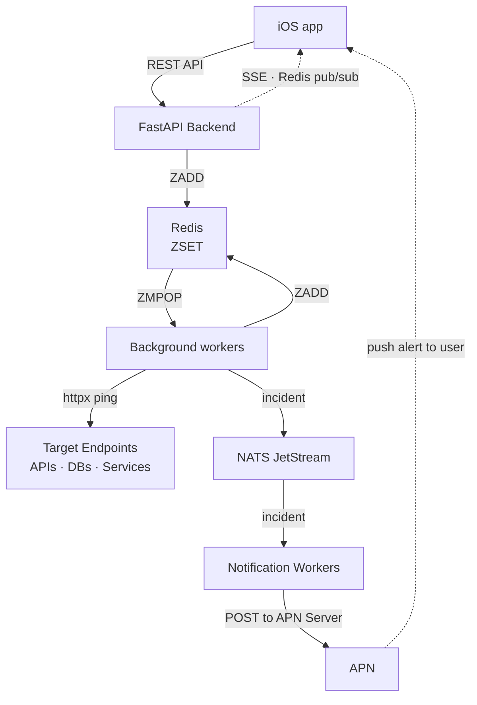

## Introduction

I recently worked on and launched a product that I'm incredibly proud of.
I created [Still200](https://still200.com), a minimalist API uptime monitoring
tool built specifically for indie devs.

The idea was born out of a sudden moment of developer panic.
One afternoon, I needed to generate some art and opened my AI image generation app, [Illumity](https://illumity.app).
Nothing loaded. I force-closed and reopened the app but still, a blank screen.
This had never happened before.

I pinged my root endpoint directly and it returned a `502 Bad Gateway` error.
That was when it hit me something was wrong with my server.
I logged into my Railway account and restarted the API service. One minute later
everything was online.

I immediately went looking for a simple tool to monitor my APIs.
I looked at existing tools but they were either too bloated with enterprise features
I didn't need or too expensive for an indie hacker's budget. That was my light-bulb moment.

I decided to build my own simple platform that could alert me not only when the API is down,
but also when other critical backend components e.g. Redis, Postgres, were down.

## The Architecture

For the system architecture, I wanted to keep things simple. Not _easy_, simple!
That meant minimal moving parts and an architecture I could jump into and debug
completely on my own if things went sideways at 2 AM.
Here are the components of my architecture that powers Still200:

* **The Interface (iOS)** - Built natively with Swift and SwiftUI.
  I chose a native mobile app for the client interface because I'm quite conversant with Swift,
  I find it elegant to write, and offers an incredible user experience.
* **API** - A purely async REST API built with FastAPI and Python.
* **Authentication & User Management** - [Supabase Auth](https://supabase.com/docs/guides/auth)
* **Database** - PostgreSQL hosted on [Supabase](https://supabase.com).
* **Schedule keeper and Job Dispatcher** - Instead of pulling in a 3rd party library for
  scheduling and task running, I built my own using [Redis sorted sets](https://redis.io/docs/latest/develop/data-types/sorted-sets) to manage high-frequency probing with high precision.
* **Incident Notifications** - [NATS messaging system](https://nats.io)
* **Live Telemetry** - Real-time monitoring data streams from the backend to the iOS app for
  UI updates using SSE (Server Sent Events) backed by [Redis pub/sub](https://redis.io/docs/latest/develop/pubsub/).
* **Observability** - [Pydantic Logfire](https://pydantic.dev/logfire)

Here's a high-level view of how the pieces fit together:




Next, let's do a deep dive into the components.

### The Scheduler

I looked at a few Python libraries for background jobs, but none quite fit my requirements.
I needed something lightweight with minimal config. The main challenge was configuring a
dynamic number of crons that run on entirely different user-defined schedules.

Celery and taskIQ are great, and I've used them in other projects before but they
did not seem to fit in nicely here no matter how hard I tried to tweak the configurations.
Standard task runners are excellent when you have fixed, pre-defined worker queues.
Forcing them into this specific paradigm felt like fitting a square peg into a round hole.

In my philosophy of keeping things simple, I turned to Redis and sorted sets in particular.
If you're unfamiliar with them, have a look at the [docs](https://redis.io/docs/latest/develop/data-types/sorted-sets/)
to understand how they work. 

For my use case, I'd add a monitor ID with its score being the next time (UNIX timestamp)
when its check is due as the score. This would look something like:
```bash
# ZADD key score member
ZADD monitor_schedule 1780503850 "9e34e9d5-7ca9-482f-b4df-ec1cc2faac62"
```
I then have a lean Python script constantly polling the sorted set for due
items. It specifically looks for any members with a score less than or equal to the current epoch timestamp.

When a monitor ID is pulled, the scheduler instantly pushes it to an execution queue
for a background worker (checker) to pick up.

### The Checker

The checker is a decoupled background worker that is responsible for doing the actual HTTP
pings against the user-defined endpoints and determine system health based on the response it receives.

This process needed to be highly concurrent so that it could handle a large number of simultaneous checks.
I leveraged Python's `asyncio`, paired with `httpx` - an excellent fully asynchronous HTTP client 
to make the actual HTTP calls concurrently without blocking.

One caveat of using Redis lists with `LPUSH/BRPOP` here is that they're a fire-and-forget system.
Once the checker worker pops an item from that task queue, it's gone. If the worker crashes before
fully performing the check then the job would be lost. To solve this problem and guarantee at-least-once execution,
I introduced another list, `processing_queue`, that would hold items that are being currently checked.
Once the check completes successfully, the item would be removed from that queue. The next check time is then computed
based on the user's configured check interval for that monitor, and then scheduled right back into the sorted set with the
new future timestamp.

In future, I will introduce another process that can check the `processing_queue` for items that might
have been sitting there for too long and maybe recycle them into the main task queue.

### Live Telemetry

To make the iOS app feel alive, I wanted real-time updates to the UI as monitors were checked.
If a user has the app open, they'll notice some monitor details like last check time or even health
status update. This felt like a massive UX win.

To achieve this, I chose SSE (Server Sent Events). In my case data flow is unidirectional - from server to client.

On the backend, Redis came to the rescue yet again. I leveraged **Redis Pub/Sub**, a lightweight,
real-time messaging pattern where publishers send messages to named channels without
knowing who will receive them, and subscribers listen to channels to receive those messages.

Here's how it operates:

1. **Publish**: The moment a background worker finishes an endpoint check, it publishes the serialized payload to a specific Redis channel.
2. **Subscribe**: On the API layer, a dedicated FastAPI streaming endpoint handles open connections from the iOS client. This endpoint subscribes to the Redis channel at runtime.
3. **Stream**: As soon as a message drops into the channel, FastAPI yields the data, streaming it instantly across the open HTTP connection straight to the client. The SwiftUI app intercepts the event and smoothly mutates the UI state.

One thing to note is that Redis Pub/Sub offers at-most-once-delivery guarantee.
I did not mind this because even if an update is missed, it's nothing critical and the
app does not break. A user would still be able to see up-to-date data if they refresh the monitor list.

### Incidents and Notifications

Systems fail. That reality is the entire reason I built Still200. When a worker detects that an endpoint
is degraded or unhealthy, users expect to know immediately that something
is wrong so they can act quickly.

Notifications are a very critical part of an uptime monitor.
Users missing notifications or notifications arriving late would mean the app isn't performing its core function.
I had to build a resilient event-driven system with an at-least-once delivery guarantee.

I chose [NATS](https://nats.io) (a high-performance, lightweight messaging system)
as the core messaging engine.

I thought about using Kafka given that's what we use at my 9-5 and I'm familiar with it,
but felt it would be overkill for my system.
NATS also has much lower administrative complexity than Kafka. Remember, my goal was to keep things _simple_.

To achieve message persistence and durability, I enabled NATS JetStream.
This allows us to ensure that notification events are never lost in transit;
a message is only acknowledged and removed from the stream once the notification
worker has successfully dispatched the alert.

When background checker identifies an issue, it triggers a two-step workflow:
1. writes an incident to the Postgres database with details about the failure.
Serves as a historical source of truth.
2. publishes a message with the incident details to the notifications subject.

On the other end of the stream, I have a notifications worker subscribed.
Once a message is received, the details from the data are properly formatted based on the notification type.
Right now, Still200 supports Apple Push Notifications, but I'll be adding more channels
(email, slack, discord) down the road.

The notifications worker, after formatting the payload that APN expects, then does a `HTTP/2 POST` request to Apple servers
which will then deliver the notification to the user's app. The message from the stream is then acknowledged.
All this happens in **under 500ms**.

NATS has been quite impressive so far.

## Lessons Learnt: What Can Go Wrong in Production

Building a system that pings a URL and looks for a 200 OK is simple.
Building a system that gracefully handles the absolute chaos of the public internet
without waking a user up with a false alarm at 3 AM is where the real engineering begins.
Here are a few things I've learnt, and how I solved or I'm planning how to solve them:


1. **Endpoint Timeouts**
An endpoint that hangs for 45 seconds without responding is arguably just as broken as an outright 502 Bad Gateway.
If a user's target service experiences an unhandled deadlock and leaves connections open,
your background worker pool can easily get starved. If your worker processes are sitting around waiting on slow endpoints,
they will miss the schedules for healthy endpoints, causing the entire platform to lag.

The fix here was to enforce strict timeouts. `httpx` easily allows one to do this.
If a target endpoint can't deliver within the set time window, the connection is instantly severed,
the failure is logged, and the worker event loop is freed up for the next job.

2. **The False Alarm Problem**
Networks are noisy. A single failed HTTP ping doesn't necessarily mean a backend is dead; it could be a transient routing glitch, a dropped packet, or a momentary load spike on the host. If your system fires an incident alert on the very first failure, your app becomes spammy.

The fix is to implement an explicit "Unhealthy Threshold".
Instead of escalating directly to NATS on a single failure, a failed check increments a counter
inside a Redis hash for that specific monitor. The system only flags an incident and sends a push notification if a monitor fails three consecutive checks.


These were just the first few hurdles of bringing Still200 to life.
As the user base grows and traffic patterns shift, I fully expect to run into new bottlenecks,
weird networking anomalies, and edge cases I haven't even conceived of yet.

But that’s the beauty of building in public. Every hard lesson is just engineering data—and fodder for the next blog post 😃

## What's Next for Still200?

With the core components in place and fully operational, Still200 is officially live.
But the work doesn't stop here. There's still a lot more to do, and I'm excited to keep building::
* **More Notification channels**
* **Expanding the Ecosystem:** Bringing the interface to the desktop with dedicated Web and macOS apps.
* **Deeper latency analytics**
* ...and so much more

Building Still200 reminded me of the absolute joy of stripping away bloated enterprise
abstractions and solving distributed systems problems with simple, fundamental building blocks.

I hope you enjoyed reading. Happy building!

